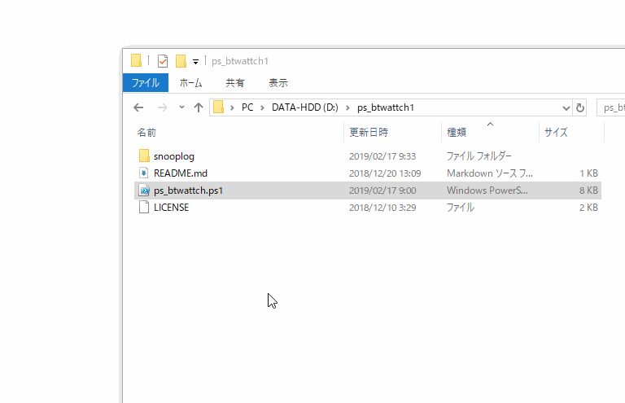

# ps_btwattch

Provides a way to read wattage, voltage and current measured by your REX-BTWATTCH1 and show them in an interactive table. You can easily sort/copy them in a reusable way.  
This script runs on Windows PowerShell v3 or above.

REX-BTWATTCH1の毎秒測定値(消費電力(W), 電圧(V), 電流(mA))をグリッドビューウインドウに表示し、データのソートやコピーなど簡単な操作が行えます。測定値は随時CSVファイルに書き出されます。  
このスクリプトの実行にはWindows PowerShell 3.0以上が必要です。

コマンド仕様は以下のページを参考にしました。  
[Armadillo-IoT G3で「Bluetooth ワットチェッカー」から計測データを表示](https://armadillo.atmark-techno.com/howto/armadillo_rex-btwattch1)

## 使い方

PowerShellから単に実行してください。(PowerShellスクリプト実行ポリシーの有効化が必要です)

```powershell
.\ps_btwattch1
```

右クリックメニューの「PowerShell で実行」からでも実行できます。



## 接続に問題がある場合

USB3.0端子に接続されたBluetoothドングルを使用した場合、周波数干渉によって接続失敗や接続タイムアウトがよく発生することを確認しています。公式のツールで安定して接続できるか確認してください。

## License

MIT
